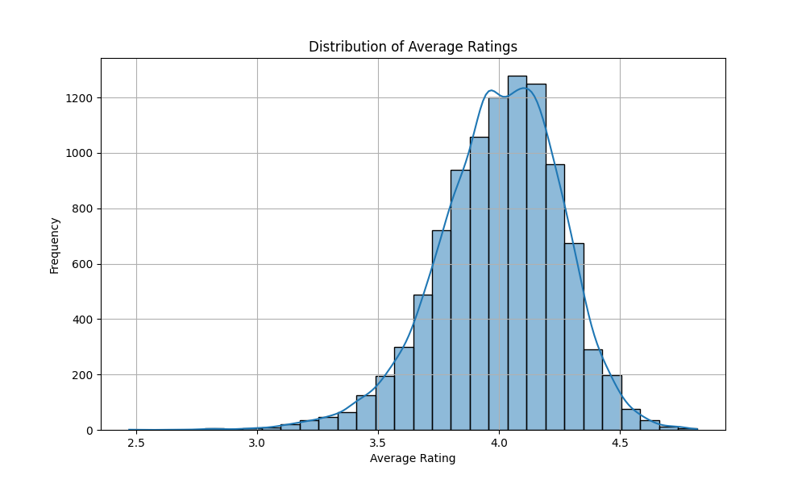
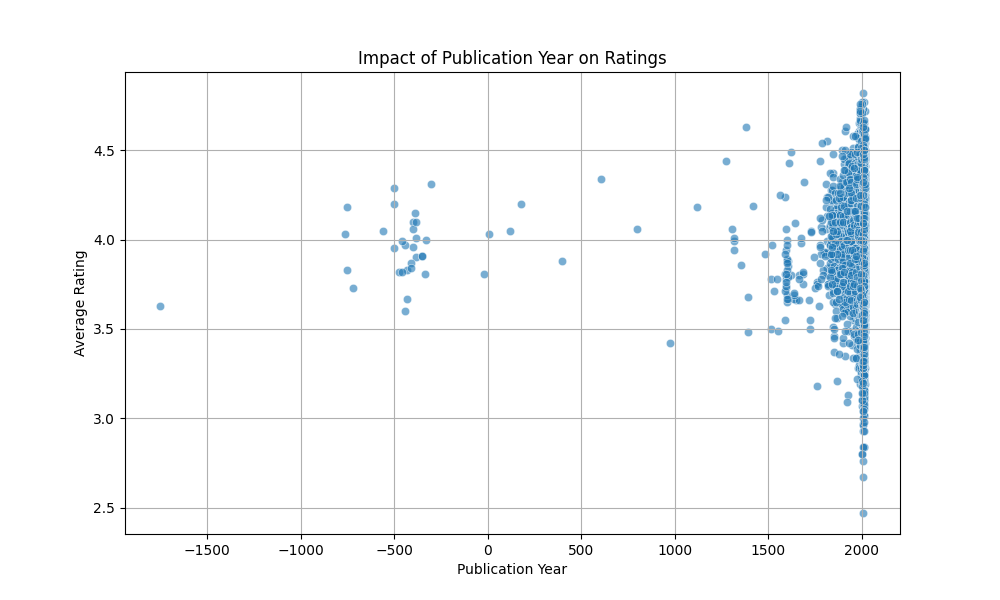
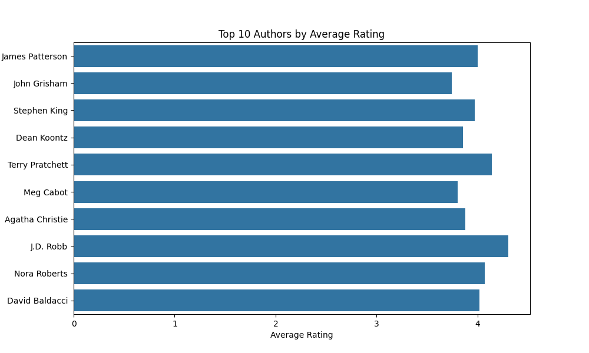

# Analysis of Goodreads Dataset
## Overview
This analysis delves into the fascinating world of books on Goodreads. We explore the average ratings and discover the authors who have captivated readers most with their writing.

## Key Findings
1. The distribution of average ratings shows a peak around the rating of 4.0, indicating that most readers tend to rate their books positively.
2. The top 10 authors demonstrate consistently high average ratings, showcasing their popularity and the quality of their works.

## 1. Distribution of Average Ratings
This visualization shows the distribution of average ratings across all books. Most books tend to be rated highly, suggesting reader satisfaction.

## 2. Impact of Publication Year on Ratings
This scatter plot reveals how publication year affects average ratings. Notably, newer books appear to receive higher ratings.

## 3. Top Authors by Average Rating
This bar chart lists the top 10 authors based on average ratings. These authors are popular choices among readers, indicating quality in their writing.

