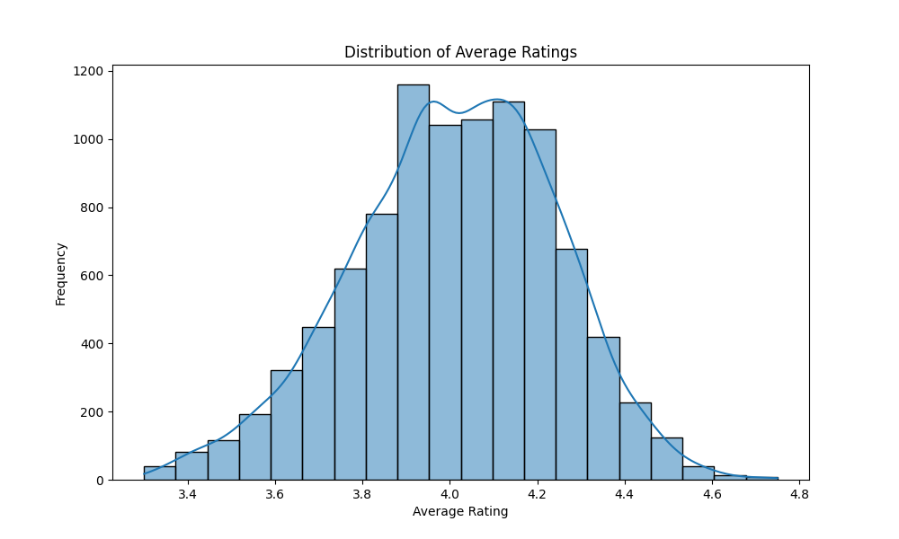
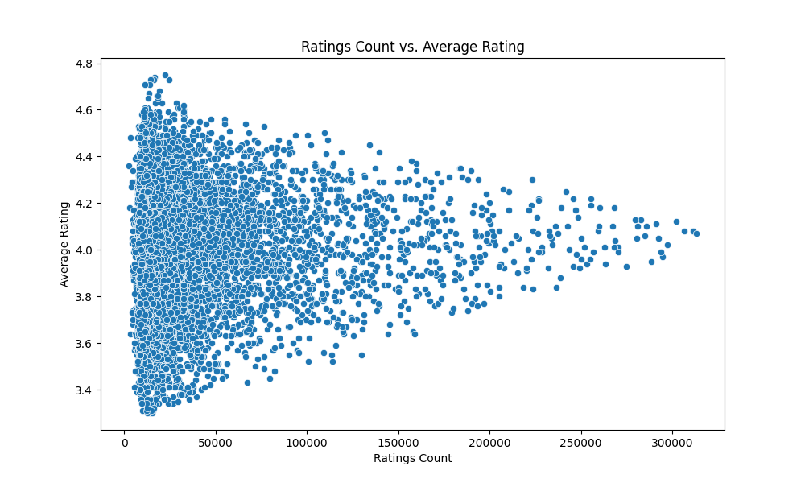

# Goodreads Data Analysis

This analysis uncovers insights from the Goodreads dataset, focusing on the distribution of book ratings, relationships between ratings count and average ratings, and highlighting top authors by their average ratings.

## Key Findings:
- The distribution of average ratings reveals a tendency towards higher ratings, indicating that readers generally rate books positively.
- A positive correlation exists between the ratings count and average rating, suggesting that popular books tend to maintain higher ratings.
- The analysis of the top authors by average rating showcases the most acclaimed writers in the dataset, providing a quick reference for readers looking for quality literature.

## Visualizations:
- 
- 
- 
