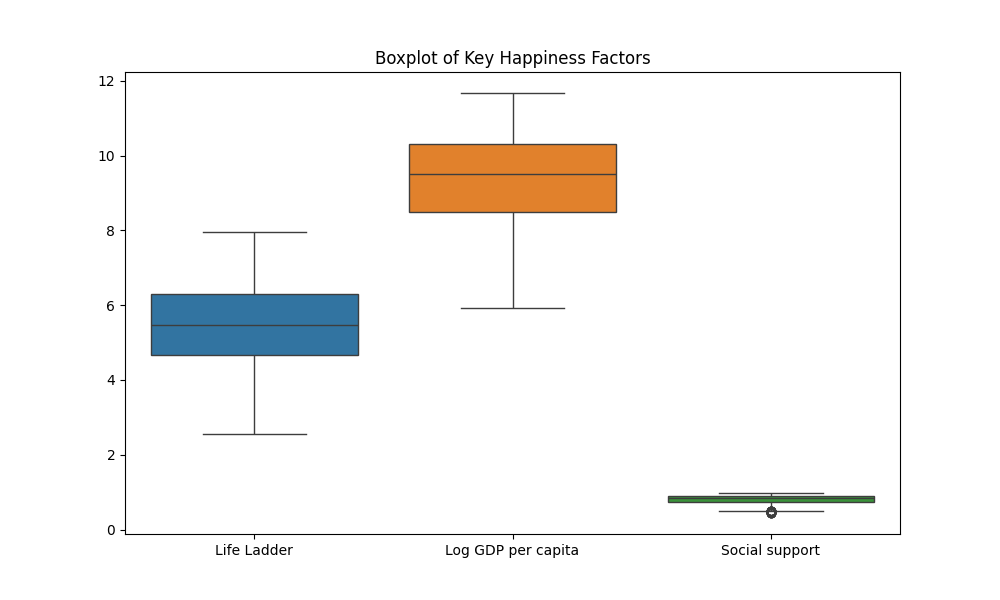
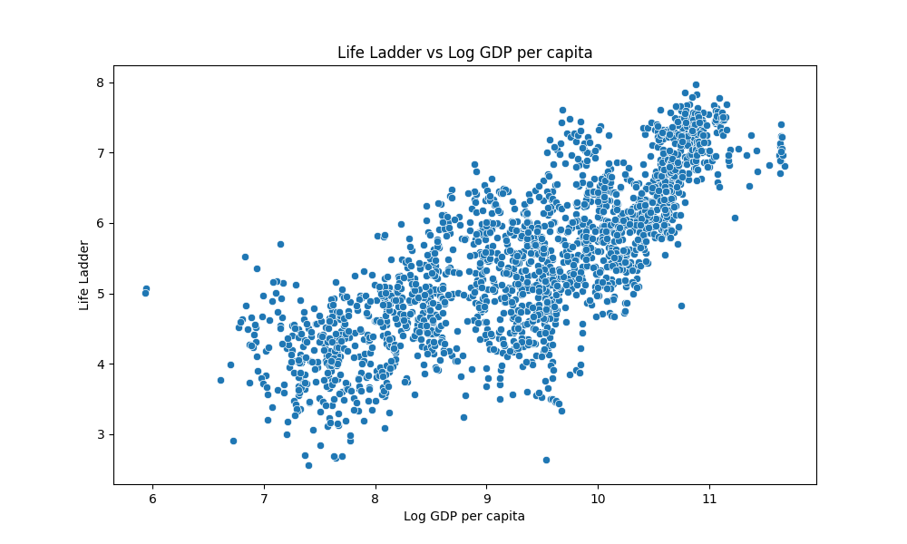

# Happiness Data Analysis

## Summary Statistics
              year  Life Ladder  Log GDP per capita  ...  Perceptions of corruption  Positive affect  Negative affect
count  1983.000000  1983.000000         1983.000000  ...                1983.000000      1983.000000      1983.000000
mean   2014.891578     5.494478            9.376103  ...                   0.757503         0.655840         0.272800
std       4.962508     1.100276            1.127851  ...                   0.167023         0.104378         0.080142
min    2005.000000     2.560000            5.935000  ...                   0.199000         0.332000         0.094000
25%    2011.000000     4.659500            8.504500  ...                   0.700000         0.574000         0.213000
50%    2015.000000     5.463000            9.518000  ...                   0.804000         0.666000         0.263000
75%    2019.000000     6.288500           10.309500  ...                   0.871000         0.740000         0.324500
max    2023.000000     7.971000           11.676000  ...                   0.983000         0.884000         0.526000

[8 rows x 10 columns]

## Insights
- The boxplot shows the distribution of key factors affecting happiness.
- The scatter plot illustrates the relationship between Log GDP per capita and the Life Ladder.

## Visualizations

