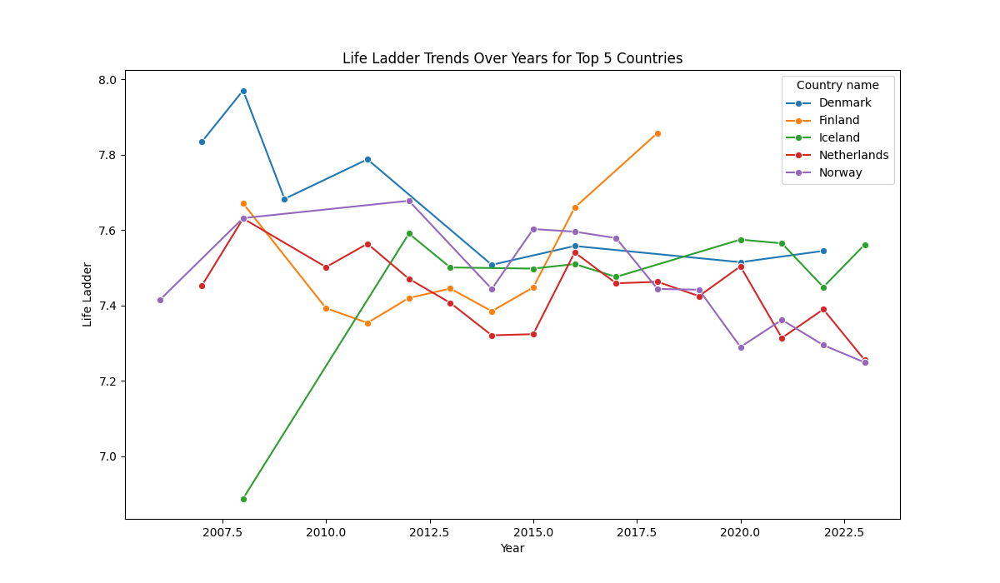
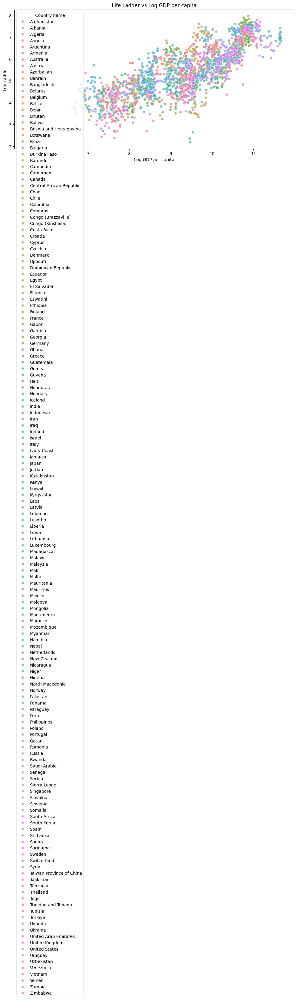

# Happiness Data Analysis

## Summary Statistics
              year  Life Ladder  Log GDP per capita  ...  Perceptions of corruption  Positive affect  Negative affect
count  2097.000000  2097.000000         2097.000000  ...                2097.000000      2097.000000      2097.000000
mean   2014.901288     5.466519            9.356038  ...                   0.747093         0.653721         0.274795
std       4.965942     1.136940            1.154684  ...                   0.183878         0.107392         0.085464
min    2005.000000     2.179000            5.527000  ...                   0.035000         0.179000         0.094000
25%    2011.000000     4.612000            8.465000  ...                   0.691000         0.572000         0.211000
50%    2015.000000     5.433000            9.497000  ...                   0.801000         0.665000         0.264000
75%    2019.000000     6.291000           10.320000  ...                   0.868000         0.740000         0.326000
max    2023.000000     7.971000           11.676000  ...                   0.983000         0.884000         0.705000

[8 rows x 10 columns]

## Visualizations

### Life Ladder Scores by Year

### Life Ladder Over Years by Country

### Life Ladder vs Log GDP per capita

The analysis provides a comprehensive insight into various determinants of happiness across different countries and over the years.