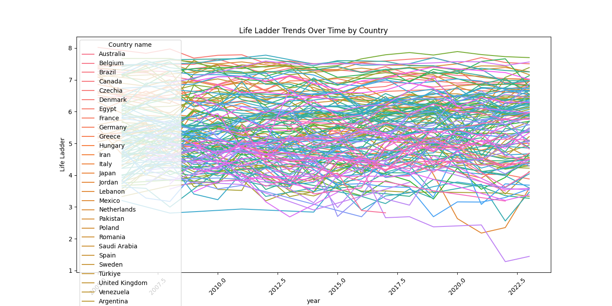
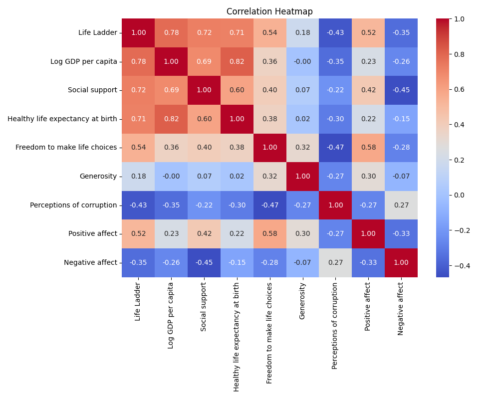
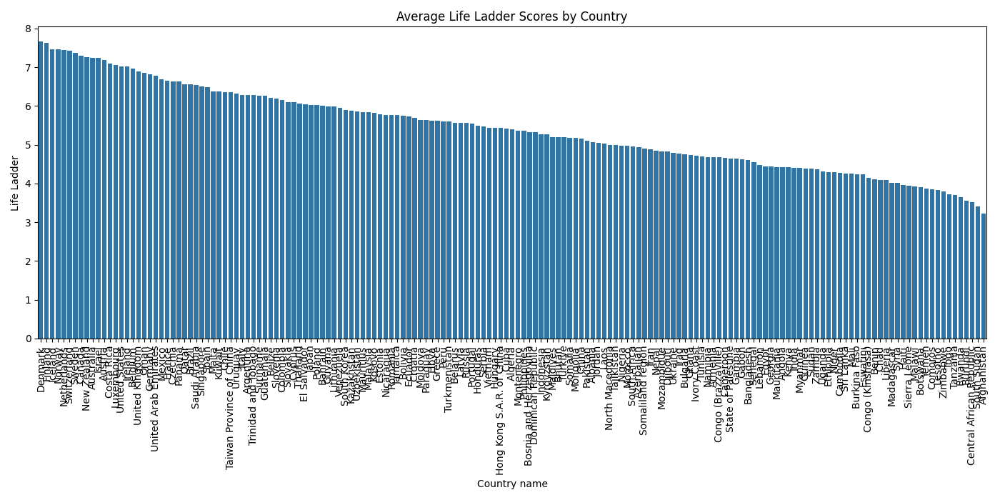

# Happiness Analysis Report

## Trend Analysis Over Time
The following chart displays the trend of Life Ladder scores over the years for various countries.

## Correlation Analysis
This heatmap shows the correlation between various factors affecting life satisfaction.

## Comparative Analysis by Region
This bar chart compares the average Life Ladder scores among countries.

