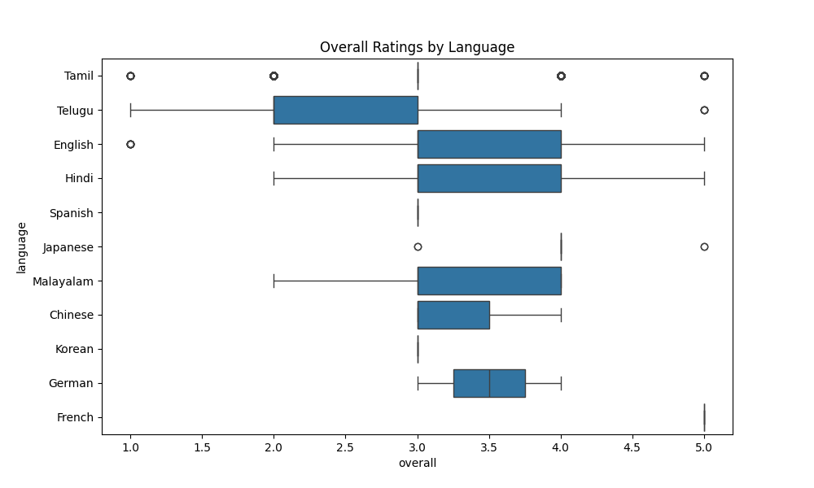
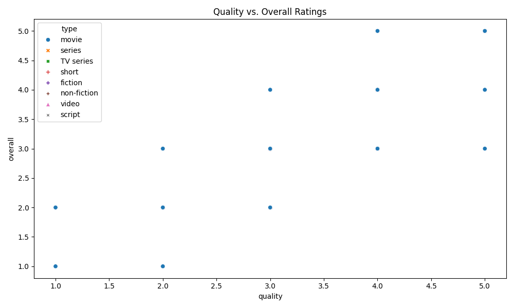
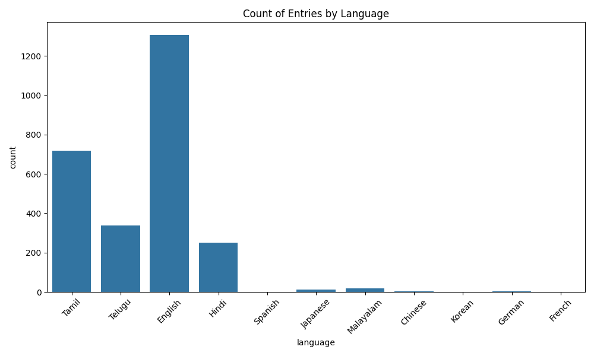

# Analysis of Media Dataset

## Overall Ratings Distribution

### Summary: Overall ratings varied significantly across different languages and types.

## Quality vs. Overall Ratings

### Summary: There is a positive correlation between quality and overall ratings.

## Language Popularity

### Summary: Tamil is the most represented language in the dataset.
