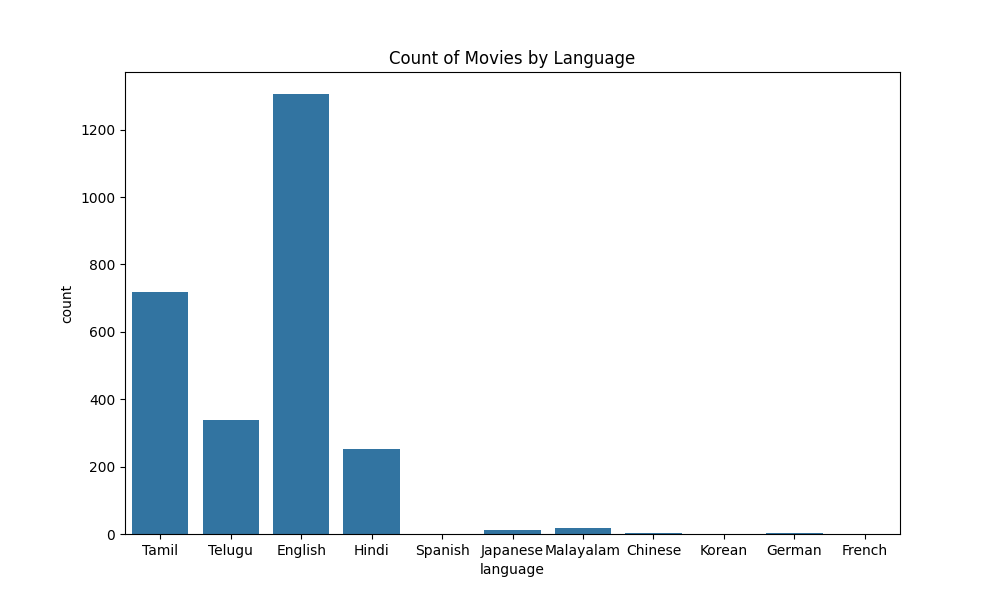
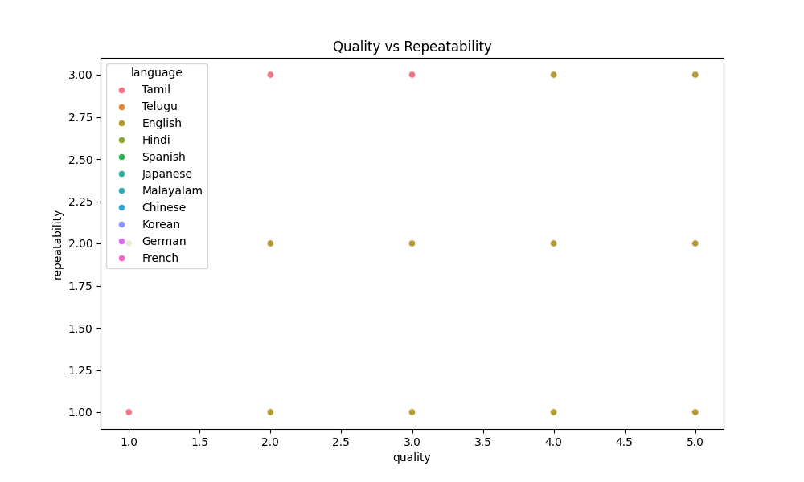

# Movie Analysis Report
## Summary
This report provides insights into the movie dataset analyzed.
- Total movies analyzed: 2652
- Languages represented: ['Tamil' 'Telugu' 'English' 'Hindi' 'Spanish' 'Japanese' 'Malayalam'
 'Chinese' 'Korean' 'German' 'French']
## Visualizations

## Conclusions
This analysis shows varying trends in movie ratings across languages and highlights the relationship between quality and repeatability.
